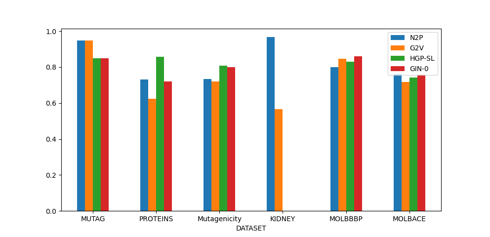

# BIONETDatasets

What is it?
- A repository of biological datasets in TUD format
- A set of python wrappers 
    + for using graphs in TUD format within the most popular graph deep learning linraries: DGL, PyTorch, Spektral, Grakel
- Publicly available at: [Github](https://github.com/giordamaug/BIONETdatasets)

---
# The TU Datasets format file

---
# Results: GIN-0

-  5-fold stratified cross validation
- learning rate: 0.001, 100 epochs, batch size: 10, 3 layers, 64 channels

|dataset|loss                         |acc   | batch | channels | epochs | elapsed |
|-------|-----------------------------|------|------|------|------|------|
|MUTAG  |0.51                         |0.85  | 10   | 64   | 100  |
|PROTEINS|0.59                        |0.72  | 10   | 64   | 100  |
|Mutagenicity    |   0.537 | 0.801 | 10   | 64   | 100  | 24:05
|ogbg-molbbbp|0.43                    |0.86  | 10   | 64   | 100  |
|ogbg-molbace|0.63                    |0.76  | 10   | 64   | 100  |

---

# Results: HGP-SL

- one-random split: 80% train, 10% val, 10% test
- learning rate: 0.001, 1000 epochs with self stop, batch size: 512, 3 layers, 128 channels, dropout 0.0

|dataset        |loss                    |acc   | batch | stopped at | struct learn | sparse att | pool_ratio | elapsed |
|---------------|------------------------|------|-------|------------|----|---|----|----|
|MUTAG          |0.389                   |0.850 | 32    | 322        | :x:  | :x: | 0.5 | 105s
|PROTEINS       |0.381                   |0.857 | 512   |            | :heavy_check_mark:  |:heavy_check_mark: | 0.5 |
|Mutagenicity       |0.456 | 0.807| 512   |  206     | :heavy_check_mark:  |:heavy_check_mark: | 0.8 | 7499
|ogbg-molbbbp   |0.45 | 0.829  | 512   | 571        |:heavy_check_mark:  |:heavy_check_mark: |0.5 |1344s
|ogbg-molbace   | 0.522                  |0.743 | 512   | 224      | :heavy_check_mark:  |:heavy_check_mark: |0.5 | 3403s

----

# Results: NETPRO2VEC

-  one-random split: 90% train, 10% test

|dataset| acc Trans.   | acc Induc. | probs | agg_by | cut_off | dim | encodew | epochs | extr| min_count | v_label | elapsed |
|---|----|----|----|----|----|----|----|----|----|----|----|---|
|MUTAG  | 0.947  | 0.947   | ["ndd"] | [1] | [0.1] | 512 | :x: | 400 | [2,2] |  1 | label | |
|PROTEINS| 0.732 | 0.714 |  ["ndd","tm1"] | [1,0] | [0,0] | 512 | :x: | 200 | [2,2] |  2 | label | |
|Mutagenicity    | 0.735 | 0.693 | ["ndd"] | [1] | [0.1] | 512 | :x: | 400 | [2,2] |  1 | label | |
|ogbg-molbbbp| 0.799 | 0.759 | ["ndd"] | [1] | [0.1] | 512 | :x: | 400 | [2,2] |  1 | label ||
|ogbg-molbace| 0.7628  | 0.790   | ["ndd"] | [1] | [0.1] | 512 | :x: | 400 | [2,2] |  1 | label | |
|KIDNEY  | 0.967  | 0.833   | ["ndd"] | [1] | [0.1] | 512 | :x: | 400 | [2,2] |  1 | label ||
|BRAIN  | 0.928  | 0.900 | ["ndd"] | [1] | [0.1] | 512 | :x: | 400 | [2,2] |  1 | label ||

---

# Results: GRAPH2VEC

-  one-random split: 90% train, 10% test

|dataset| acc Trans.   | dim | epochs | wl | elapsed|
|---|----|---|---|---|----|
|MUTAG  | 0.947  |  512  | 400 | 3 |   |
|PROTEINS| 0.625 | 128  | 200 | 5 |   |
|Mutagenicity    | 0.719 | 128  | 200 | 3 | 1m15s |
|ogbg-molbbbp| 0.848 |  128  | 200 | 3 | 24s |
|ogbg-molbace| 0.717 |  128  | 200 | 3 | 23s |
|KIDNEY  | 0.566  |  128  | 200 | 3 |

---

# Results

